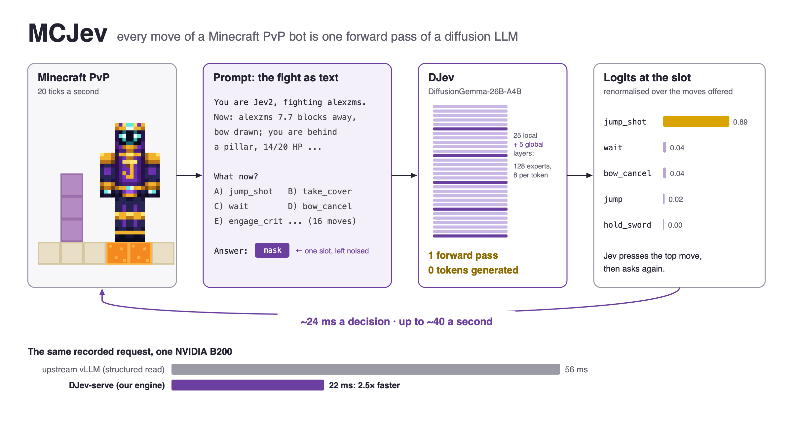
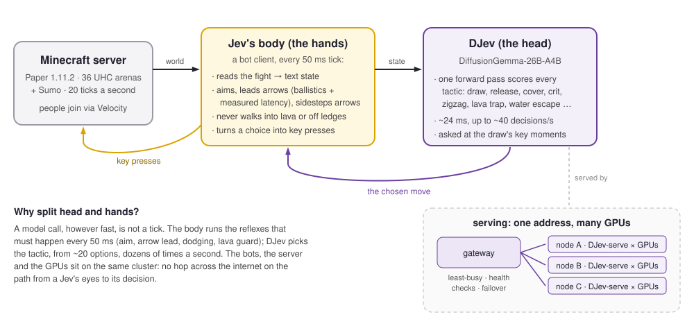

# MCJev

**A diffusion LLM that fights you in Minecraft, 40 decisions a second.**

[Blog post](https://haoailab.com/blogs/mcjev/) · [X post](https://x.com/haoailab/status/2104302648786919643) · Play: `mc.alexzms.com` (Minecraft Java 1.9+)

MCJev puts the **Jev** model in a Minecraft PvP arena. Every move of a Jev bot, in Block UHC (sword, bow, lava and
water buckets, blocks) and Sumo, is picked by **DJev**: Google's open-weight text-diffusion LLM
[DiffusionGemma-26B-A4B](https://huggingface.co/google/diffusiongemma-26B-A4B-it), asked as a
[Jev](https://typesafe.ai/blog/introducing-system-one-models-and-jev)-style decision model. Instead of writing an
answer token by token, DJev scores every move Jev could make **in one forward pass, with zero tokens generated**.
Served by **DJev-serve**, our engine on top of vLLM, one decision takes **~24 ms** on a single Blackwell GPU: 2.5×
faster than the same model on the original vLLM, fast enough to decide up to ~40 times a second, faster than the
server's own 20 Hz tick. In the first 32 hours after release, 54 people played 1,795 rounds against Jev; in Block UHC
it won 70% of its rounds against real human players.



## What is in this repository

| | |
|---|---|
| [`serving/`](serving) | **DJev-serve**: DiffusionGemma as a decision model behind the `POST /api/evaluate` contract. A reference Hugging Face server, vLLM engines, and the fast path that runs one forward per decision from a single CUDA graph (prefix-cache slots, FlashAttention-2 on the sliding-window layers, tuned Triton for the global layers, batching of queued reads), plus a load-balancing gateway, benchmarks and performance notes. |
| [`harness/`](harness) | **The Jev harness**: a mineflayer body that plays at 20 ticks a second (aim, arrow lead and dodge, lava and ledge guards) and a Python head that writes the fight as text, offers the moves, and asks DJev-serve. Every harness version from the first to the one that played the public (`p_uhc_pro_v10`), Sumo and 2v2, plus plugin-free arena referees. |

## How it works

**Head and hands.** A model call, however fast, is not a tick. The body runs the reflexes that must happen every
50 ms; the head picks the tactic, out of ~20 options, dozens of times a second.



**Scoring, not generating.** DiffusionGemma pairs a causal encoder over the prompt with a bidirectional decoder that
denoises a canvas of answer tokens. DJev writes the answer scaffold into the canvas and leaves only the answer slot
masked; one decoder pass fills it, and the logits at the slot, restricted to the options' tokens and renormalised,
are a full distribution over the moves. Jev presses the top one and asks again ~24 ms later.

**From 174 ms to 24 ms.** In Hugging Face transformers one decision took 174 ms, mostly kernel launches (10,340 per
forward for 55 ms of GPU work). The original vLLM brought it to ~60 ms. DJev-serve keeps vLLM's model code, paged KV
cache and kernels, drops the scheduler and runs exactly one forward per decision: ~26 ms end to end on a B200, of which
22.8 ms is the GPU forward. Details in [serving/docs/PERFORMANCE.md](serving/docs/PERFORMANCE.md).

## Quick start

You need an NVIDIA GPU with ~50 GB of memory, a Minecraft Java 1.11.2 server (Paper or Spigot, `online-mode=false`),
Python 3.10+ and Node.js 22+.

```bash
# 1. Serve DJev (see serving/README.md for the vLLM nightly it needs)
pip install vllm --pre --extra-index-url https://wheels.vllm.ai/nightly
pip install -r serving/requirements.txt
serving/serve.sh                                 # http://127.0.0.1:8765, prints {"ready": true}
python serving/client.py                         # a test request

# 2. Run a Jev on your Minecraft server
cd harness/body && npm install && cd ..
echo 'JEV_URL=http://127.0.0.1:8765' > .env
python3 -u agent.py --name Jev1 --harness p_uhc_pro_v10 --vision off --host 127.0.0.1 --port 25565 --quiet

# 3. Start a fight (server console or RCON)
tell Jev1 fight Steve: kill Steve (Block UHC)
```

`harness/scenes/uhc_arena.py` builds a Block UHC arena and referees rounds over RCON; see
[harness/README.md](harness/README.md).

## Acknowledgements

We especially thank **NVIDIA** for providing the **B200** GPUs that MCJev runs on. We thank Google for releasing
DiffusionGemma with open weights; the [vLLM](https://github.com/vllm-project/vllm),
[FlashAttention](https://github.com/Dao-AILab/flash-attention), [FlashInfer](https://github.com/flashinfer-ai/flashinfer)
and [mineflayer](https://github.com/PrismarineJS/mineflayer) projects that MCJev builds on; TypeSafe AI for the Jev
idea; the [NanoJev](https://github.com/TianyuCodings/NanoJev) contributors, whose request contract DJev-serve
implements (`serving/server.py` adapts their `validate_request`); and everyone who logged in and fought Jev.

## Citation

If you use MCJev, please cite:

```bibtex
@misc{mcjev2026,
  title        = {{MCJev}: A Diffusion {LLM} That Fights You in {Minecraft}, 40 Decisions a Second},
  author       = {Zhang, Minshen and Chen, Junda and Yang, Yuanbo and Zhang, Yuxuan and Sun, Yi and Duan, Shaoxiong and Lin, Will and Zhang, Hao},
  year         = {2026},
  month        = sep,
  howpublished = {Hao AI Lab blog},
  url          = {https://haoailab.com/blogs/mcjev/}
}
```

MCJev builds on these works:

```bibtex
@misc{typesafe2026jev,
  title        = {Introducing System One Models and {Jev}},
  author       = {{TypeSafe AI}},
  year         = {2026},
  howpublished = {\url{https://typesafe.ai/blog/introducing-system-one-models-and-jev}}
}

@misc{nanojev2026,
  title        = {{NanoJev}: A Nano Replica of {Jev}},
  author       = {{OpenJev contributors}},
  year         = {2026},
  howpublished = {\url{https://github.com/TianyuCodings/NanoJev}}
}

@misc{diffusiongemma2026,
  title        = {{DiffusionGemma}},
  author       = {{Google}},
  year         = {2026},
  howpublished = {\url{https://huggingface.co/google/diffusiongemma-26B-A4B-it}}
}

@inproceedings{kwon2023vllm,
  title        = {Efficient Memory Management for Large Language Model Serving with {PagedAttention}},
  author       = {Kwon, Woosuk and Li, Zhuohan and Zhuang, Siyuan and Sheng, Ying and Zheng, Lianmin and Yu, Cody Hao and Gonzalez, Joseph E. and Zhang, Hao and Stoica, Ion},
  booktitle    = {Proceedings of the 29th Symposium on Operating Systems Principles (SOSP)},
  year         = {2023}
}

@inproceedings{dao2024flashattention2,
  title        = {{FlashAttention-2}: Faster Attention with Better Parallelism and Work Partitioning},
  author       = {Dao, Tri},
  booktitle    = {International Conference on Learning Representations (ICLR)},
  year         = {2024}
}
```

## License

Apache License 2.0 (see [LICENSE](LICENSE)). Code adapted from other projects keeps its license; see
[THIRD_PARTY_NOTICES.md](THIRD_PARTY_NOTICES.md).
